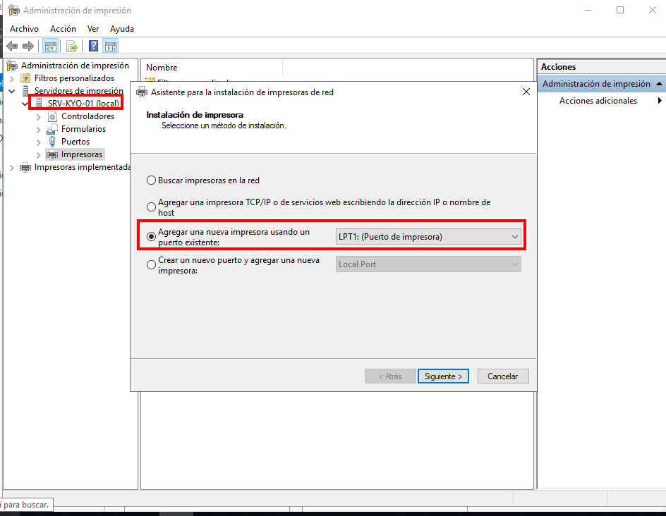
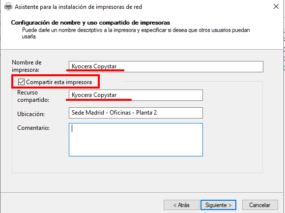
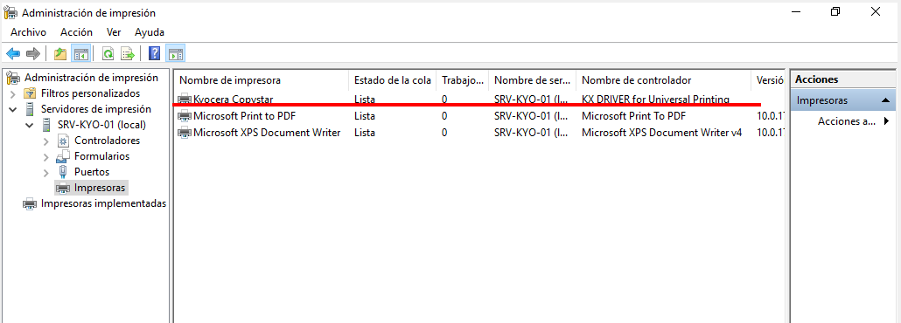
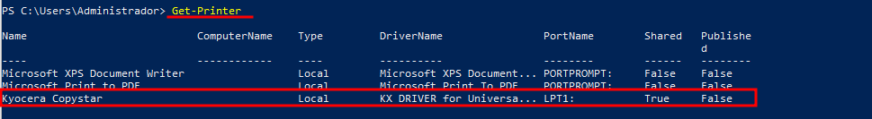
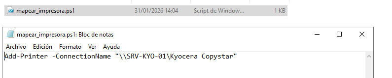
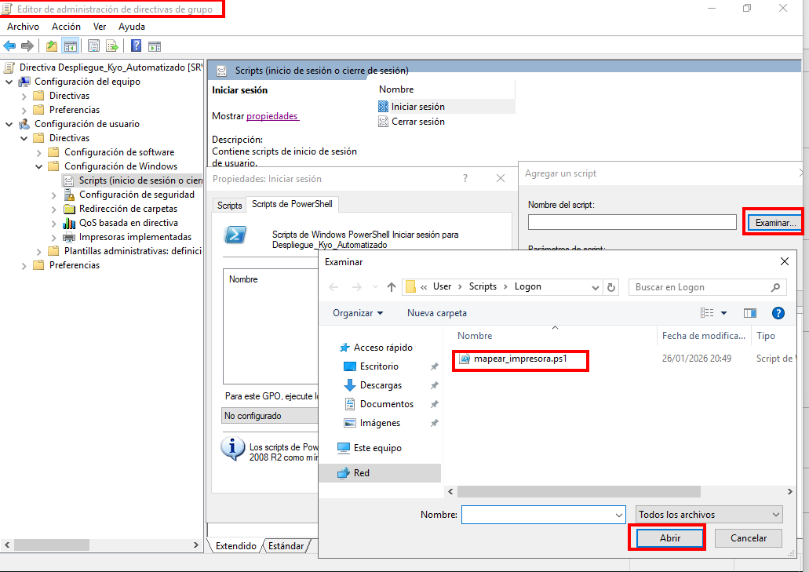
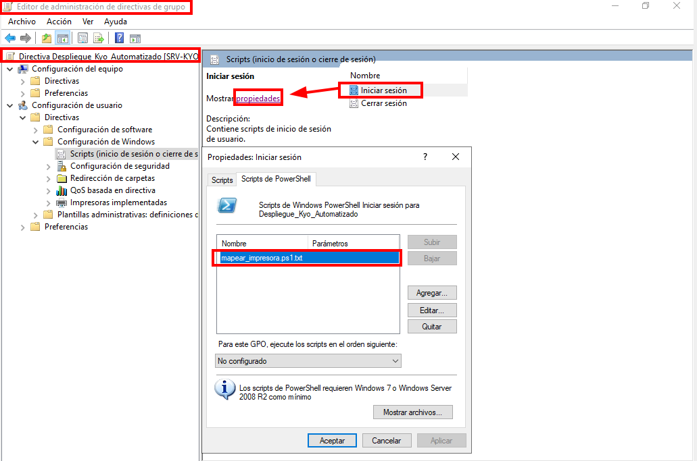

He buscado configurar una impresora local en el servidor y mapearla automáticamente a los usuarios del dominio mediante Script y GPO al iniciar sesión.

## Prerequisitos:
### Infraestructura
Este laboratorio tiene una infraestructura previa formada por una virtualización  de  **windows server 2019** con el servicio de AD  y un **windows 10** funcionando como cliente. Ambos equipos configurados en una **red interna** .

- **Dominio:** `kyolabs.local`
- **Red:** comunicación red interna. 
	- `192.168.1.0/24`
- **Equipos:**
	- **Servidor (AD y Print Server)** `192.168.1.10`
	- **Cliente (Marta)** `192.168.1.11`
- **Roles instalados:** Active Directory, Servicios de impresión y documentos. 


---

## Paso1: Instalación del controlador  en el servicio y compartir recurso.

Instalamos el driver de `Kyocera`.
Utilizamos el puerto local `LPT1` para permitir que el servidor instale los drivers y comparta la cola de impresión sin intentar contactar continuamente con la impresora física (ya que no existe en este entorno virtual)

**Agregamos la impresora desde LPT1:**
<p align="center">  </p>


**Elegimos los drivers**
Podemos elegir entre los drivers genéricos de Windows, sin embargo, para este laboratorio instalamos los específicos de **Kyocera**. Si no estuvieran disponibles, podemos actualizar la lista con `Windows Update`.

Es importante que seleccionemos **`Compartir esta impresora`** para habilitar el uso compartido.
Además debemos definir un nombre del recurso: `Kyocera Copystar`


<p align="center">  </p>


Al finalizar, verificamos la impresora en el **Administrador de impresión**:

<p align="center">  </p>

Una comprobación alternativa desde la `PS` sería utilizando el comando 
```
Get-Printer
```
<p align="center">  </p>


---

## Paso 2: Automatización 

Creamos un **Script** de mapeo en el bloc de notas con este contenido:
```PowerShell
Add-Printer -ConnectionName "\\SRV-KYO-01\Kyocera Copystar"
```
Es **importante** comprobar que tenga la extensión `.ps1` ya que por defecto se guardará en `.ps1.txt`  y la `GPO` no lo reconozca como ejecutable.

<p align="center">  </p>


## Paso 3 : Configuración GPO

Creamos una **Directiva de Grupo (GPO)** vinculada a la Unidad Organizativa (OU) correspondiente. **Ruta:** `Configuración de usuario > Directivas > Conf. de Windows > Scripts (Inicio de sesión)`.

Debemos añadir el script en la pestaña **'Scripts de PowerShell'** y no en la pestaña estándar 'Scripts', ya que de lo contrario el sistema intentará ejecutarlo como un batch (.bat) y fallará

<p align="center">  </p>
<p align="center">  </p>


---

## Paso 4: Verificación en el cliente

Iniciamos sesión en el cliente Windows 10 con un usuario del dominio (`Marta`). Si es necesario, forzamos la actualización de directivas desde CMD:

```cmd
gpupdate /force
```
<p align="center">  </p>


Cerramos sesión, iniciamos y dejamos unos segundos para que el sistema cargue. 
Y lo tenemos: 🚀🚀
<p align="center">  </p>
